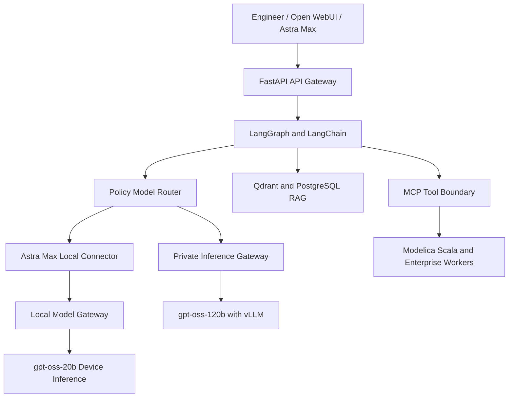
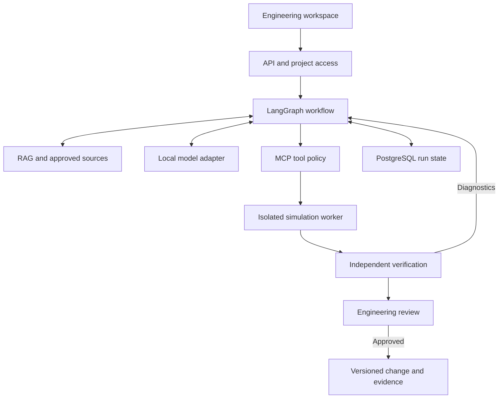

# JFXLCDP — Spec-Driven Low-Code Development Platform

[](https://github.com/robotics-intelligent-systems/jfxlcdp)
[](https://github.com/robotics-intelligent-systems/jfxlcdp/tree/main/MBSE/CAS/Drawio)
[](https://github.com/robotics-intelligent-systems/jfxlcdp)
[](https://github.com/robotics-intelligent-systems/jfxlcdp)
[](#license)

> **Spec-Driven Low-Code Development Platform for AI-assisted software engineering, MBSE, simulation, scientific computing, digital twins and engineering code generation.**

> **Authoritative architecture reference:** this consolidated README is regenerated from the `docs/expand-open-source-ai-integration` branch of [robotics-intelligent-systems/jfxlcdp](https://github.com/robotics-intelligent-systems/jfxlcdp/tree/docs/expand-open-source-ai-integration). Earlier generated descriptions are not used as the architectural base.

---

## Table of Contents

- [Description and Context](#description-and-context)
- [Vision](#vision)
- [Objectives](#objectives)
- [Key Concepts](#key-concepts)
- [Functional Scope](#functional-scope)
- [Architecture](#architecture)
- [Spec-Driven Development](#spec-driven-development)
- [AI-Assisted Engineering](#ai-assisted-engineering)
- [Open-Source AI Integration Proposal](#open-source-ai-integration-proposal)
- [Astra Max Work Plugin and Local gpt-oss Connector](#astra-max-work-plugin-and-local-gpt-oss-connector)
- [AI Agent Architecture](#ai-agent-architecture)
- [MBSE Integration](#mbse-integration)
- [Low-Code Development](#low-code-development)
- [Modeling and Simulation](#modeling-and-simulation)
- [Digital Twin Architecture](#digital-twin-architecture)
- [Software Dependency Compendium](#software-dependency-compendium)
- [Dependency Classification](#dependency-classification)
- [Technology Matrix](#technology-matrix)
- [Recommended Technology Stack](#recommended-technology-stack)
- [Data and Model Interoperability](#data-and-model-interoperability)
- [User Guide](#user-guide)
- [Installation Guide](#installation-guide)
- [Development Workflow](#development-workflow)
- [Testing and Validation](#testing-and-validation)
- [Security and Responsible AI](#security-and-responsible-ai)
- [Repository Structure](#repository-structure)
- [CI/CD](#cicd)
- [Roadmap](#roadmap)
- [How to Contribute](#how-to-contribute)
- [Code of Conduct](#code-of-conduct)
- [Authors](#authors)
- [Additional Information](#additional-information)
- [License](#license)

---

# Description and Context

JFXLCDP is a research and engineering project focused on **Specification-Driven Development (SDD)** and **Low-Code Development**, with an open-source target architecture.

The project explores how natural-language and formal engineering specifications can become executable artifacts through a combination of:

- Artificial Intelligence
- Large Language Models
- Model-Based Systems Engineering (MBSE)
- Specification-Driven Development
- Model-Driven Engineering (MDE)
- Low-Code / No-Code development
- Modelica-based simulation
- Scientific Machine Learning
- Engineering AI agents
- Model transformation
- Code generation
- Digital twins
- CAD/CAM/CAS workflows
- Distributed engineering workflows
- Multi-domain system modeling

The current repository documents an extensive technology ecosystem covering MBSE, aerospace engineering, Modelica, AI-assisted development, knowledge bases, simulation, formal specifications, rule engines and engineering software generation.

The proposed AI integration turns this ecosystem into an **engineering copilot** that helps engineers formalize requirements, retrieve approved project knowledge, generate reviewable Modelica and application changes, run controlled simulations, and assemble verification evidence. The reference path combines **LangGraph, MCP, locally served models, Qdrant, PostgreSQL and OpenModelica** through replaceable adapters.

The central engineering asset is a versioned chain of evidence: **requirement, specification, model revision, simulation configuration, result and review decision**. Generated forms, APIs and simulation dashboards should derive from the same reviewed specification. This connects the low-code interface to MBSE and scientific computing while keeping mathematical checks in executable validators.

**Current status:** the repository contains this README and engineering diagrams under `MBSE/CAS/Drawio`. The AI services, tool contracts, deployment profiles and acceptance criteria below are **proposed work**, with no integrated runtime or benchmark results established here. The repository does not yet contain a license file; the [license section](#license) describes that outstanding project decision.

The expanded proposal develops the existing [Modex AI / Modelica multidomain architecture](MBSE/CAS/Drawio/modex_ai_modelica_open_source_multidomain.drawio), preserving its MBSE, specification, simulation and local AI direction.

---

# Vision

The long-term vision is to establish an open engineering platform where:

```text
Human / Engineering Requirement
            ↓
Natural Language Specification
            ↓
Formal Specification
            ↓
System Model
            ↓
AI-Assisted Architecture
            ↓
Executable Model
            ↓
Simulation
            ↓
Validation
            ↓
Generated Software
            ↓
Digital Twin
            ↓
Operational System
```

The platform should reduce the distance between:

```text
Requirements
     ↓
Architecture
     ↓
Models
     ↓
Simulation
     ↓
Implementation
     ↓
Verification
     ↓
Deployment
```

---

# Objectives

## Primary Objectives

1. Implement specification-driven software development.
2. Integrate AI into engineering workflows.
3. Convert natural-language requirements into formal specifications.
4. Generate software and engineering models from specifications.
5. Integrate MBSE with AI-assisted development.
6. Support Modelica and scientific simulation workflows.
7. Enable low-code engineering application development.
8. Connect specifications, models, simulations and implementation.
9. Support digital-twin architectures.
10. Provide interoperable engineering workflows.

## Secondary Objectives

- Reduce repetitive engineering work.
- Improve traceability between requirements and implementation.
- Automate model generation.
- Enable AI-assisted simulation.
- Support multidisciplinary engineering.
- Provide reusable engineering components.
- Improve software verification.
- Enable human-in-the-loop engineering.

---

# Key Concepts

## Specification-Driven Development

Specification-Driven Development changes the traditional software engineering workflow.

Instead of:

```text
Requirement
   ↓
Manual Design
   ↓
Manual Coding
   ↓
Testing
```

JFXLCDP promotes:

```text
Specification
   ↓
AI Interpretation
   ↓
Formal Model
   ↓
Architecture
   ↓
Generated Implementation
   ↓
Simulation / Verification
   ↓
Validated Software
```

The specification becomes a first-class engineering artifact rather than disposable documentation.

---

# Functional Scope

JFXLCDP can be organized into the following functional domains.

| Domain | Purpose |
|---|---|
| Specification Engineering | Requirements and executable specifications |
| AI Engineering | LLM-assisted engineering workflows |
| MBSE | Systems architecture and modeling |
| Model-Driven Engineering | Model transformation and generation |
| Low-Code | Application generation |
| Scientific Computing | Numerical and scientific models |
| Simulation | Dynamic system simulation |
| Digital Twins | Runtime engineering representations |
| Code Generation | Automatic implementation generation |
| Verification | Model and implementation validation |
| Knowledge Engineering | Engineering knowledge bases |
| Workflow Automation | Multi-stage engineering pipelines |
| MCP Integration | AI-to-engineering tool integration |

---

# Architecture

The conceptual architecture is:

```text
┌─────────────────────────────────────────────────────────────┐
│                    ENGINEERING USERS                        │
│  Systems Engineers | Developers | Scientists | Designers    │
└─────────────────────────────┬───────────────────────────────┘
                              │
                              ▼
┌─────────────────────────────────────────────────────────────┐
│                SPECIFICATION INTERFACE                      │
│                                                             │
│ Natural Language | SRS | SDD | UML | SysML | JML | PMML    │
└─────────────────────────────┬───────────────────────────────┘
                              │
                              ▼
┌─────────────────────────────────────────────────────────────┐
│                     AI ENGINEERING                          │
│                                                             │
│ LLM | Agents | MCP | RAG | Planning | Code Generation       │
└─────────────────────────────┬───────────────────────────────┘
                              │
                              ▼
┌─────────────────────────────────────────────────────────────┐
│                 MODEL / SPECIFICATION LAYER                 │
│                                                             │
│ MBSE | SysML | Modelica | EMF | Capella | OpenMBEE          │
└─────────────────────────────┬───────────────────────────────┘
                              │
             ┌────────────────┼─────────────────┐
             ▼                ▼                 ▼
       ┌───────────┐    ┌────────────┐   ┌─────────────┐
       │ Simulation│    │Code Gen.   │   │Digital Twin │
       │           │    │            │   │             │
       │ SciML     │    │ Ada        │   │ O3DE        │
       │ Modelica  │    │ C/C++      │   │ Godot       │
       │ Drake     │    │ Python     │   │ 3D Engines  │
       └───────────┘    └────────────┘   └─────────────┘
             │                │                 │
             └────────────────┼─────────────────┘
                              ▼
                    ┌──────────────────┐
                    │ Verification &   │
                    │ Validation       │
                    └──────────────────┘
```

---

# Spec-Driven Development

The platform treats specifications as executable engineering assets.

## Specification Lifecycle

```text
Requirement
     ↓
Specification
     ↓
Formalization
     ↓
Model
     ↓
Transformation
     ↓
Implementation
     ↓
Simulation
     ↓
Verification
     ↓
Deployment
```

## Supported Specification Concepts

- Natural-language requirements
- Software Requirements Specifications
- SDD
- SRS
- UML
- UML-RT
- SysML
- JML
- SWRL
- PMML
- HWML
- Aircraft Data Hierarchy
- XMCDA
- Modelica specifications

---

# AI-Assisted Engineering

AI should help engineers interpret specifications, find relevant evidence, propose artifacts and explain diagnostics. Executable validators establish whether a proposal satisfies its declared contracts. A successful compilation establishes structural feasibility; physical validity requires appropriate equations, assumptions, boundary conditions and comparison with reference behavior.

# Open-Source AI Integration Proposal

## Purpose and Design Decisions

Build a self-hosted, modular engineering copilot around the existing specification and Modelica architecture. Its first useful outcome is a reproducible requirement-to-simulation workflow with a reviewable change and an evidence report.

| Decision | Proposed approach | Engineering benefit |
|---|---|---|
| Specification as the source of intent | Version requirements, units, constraints and acceptance criteria before generation | Make outputs testable and changes traceable |
| Local inference as the reference path | Run selected model weights on controlled infrastructure; keep provider access behind an adapter | Allow deployment without a mandatory hosted model subscription |
| Explicit workflow orchestration | Use a bounded LangGraph graph with persistent state and review points | Make progress, retries and failures inspectable |
| Typed engineering tools | Expose narrowly scoped operations through MCP and application APIs | Reuse the same services from agents, the UI and automated checks |
| Evidence-backed retrieval | Retrieve approved, versioned knowledge and attach citations | Make engineering explanations auditable |
| Solver-based verification | Use OpenModelica and independent numerical assertions | Check generated models against measurable requirements |
| Portable artifacts | Store specifications, source models, contracts and results in documented formats | Keep the project usable across editors, model providers and execution environments |

These are JFXLCDP architecture recommendations. The upstream projects linked below provide building blocks; an upstream feature does not establish a working JFXLCDP integration.

## Capabilities and Deliverables

| Capability | Input | Proposed output | Acceptance boundary |
|---|---|---|---|
| Requirements assistant | Natural-language requirement and approved domain vocabulary | Structured requirement, assumptions, unresolved questions and acceptance criteria | Missing units or limits remain unresolved until supplied |
| Engineering knowledge assistant | Question and authorized project revision | Answer with source path, revision and passage references | Abstain when supporting evidence is missing |
| Modelica assistant | Reviewed specification and approved library catalog | Model patch, interface map and simulation plan | Validate syntax, interfaces, units and numerical behavior |
| Simulation assistant | Model revision and bounded experiment definition | Job identifier, diagnostics, result series and assertion report | Success comes from worker results and validators |
| Low-code application assistant | Reviewed schema and simulation API contract | Generated parameter forms, API schemas, dashboards and tests | Generated artifacts agree with the specification and API |
| MBSE traceability assistant | Requirement identifiers and imported model elements | Links from requirements to architecture, models and test evidence | Preserve source identifiers; require review of semantic mappings |
| Change and repair assistant | Failing checks and current artifact revision | Minimal candidate patch with reasons and a new validation run | Bounded repair attempts; retain the previous evidence |

For the first MVP, these capabilities can be graph nodes in one application. Separate agents, services or models should be introduced when a measured workload or ownership boundary justifies them.

## Reference Components

All entries are candidates for implementation. Choose one implementation per responsibility in the MVP.

| Responsibility | Reference component | Initial use or substitution boundary |
|---|---|---|
| Application API | [FastAPI](https://github.com/fastapi/fastapi) | Validate requests, enforce project access, serve workflow status and expose reviewed contracts |
| Workflow state | [LangGraph](https://github.com/langchain-ai/langgraph) | Coordinate retrieval, generation, validation, repair and review; persist checkpoints |
| Local model serving | [Ollama](https://github.com/ollama/ollama) | Initial workstation runtime; explicitly select local models |
| Shared model serving | [vLLM](https://github.com/vllm-project/vllm) | Alternative inference service when concurrent workloads justify it |
| Engineering tool protocol | [MCP Python SDK](https://github.com/modelcontextprotocol/python-sdk) | Implement JFXLCDP tool adapters with schema-validated arguments |
| Vector retrieval | [Qdrant](https://github.com/qdrant/qdrant) | Index engineering passages with project, revision and access metadata |
| Durable records | [PostgreSQL](https://www.postgresql.org/) | Specifications, traceability edges, checkpoints, job records and review decisions |
| Modelica execution | [OpenModelica through OMPython](https://openmodelica.org/doc/OpenModelicaUsersGuide/latest/ompython.html) | Isolated model checking, compilation and simulation workers |
| FMU execution | [FMPy](https://fmpy.readthedocs.io/en/latest/) | Optional FMI adapter after native Modelica execution is accepted |
| Team identity | [Keycloak](https://www.keycloak.org/documentation) | Optional OIDC provider for a shared deployment |
| Telemetry | [OpenTelemetry](https://opentelemetry.io/docs/what-is-opentelemetry/) | Instrument model calls, retrieval, tool operations and worker execution |

Use a filesystem volume for initial result artifacts, with identifiers and checksums stored in PostgreSQL. Introduce an object-store adapter when deployment needs justify it. Qdrant is a derived search index; source documents and durable engineering records remain independently recoverable.

The proposed model adapter should expose generation and embedding capabilities with explicit capability checks. [Ollama documents partial OpenAI API compatibility](https://docs.ollama.com/api/openai-compatibility), and [vLLM provides an API server](https://github.com/vllm-project/vllm). Shared endpoint conventions do not guarantee identical structured-output, tool-call, streaming or context behavior. Test the exact server/model combination before enabling a capability; schema validation remains an application responsibility.

## Model Selection and License Boundaries

Start with a small, reproducible model evaluation instead of selecting by a general leaderboard. Two concrete candidates are:

| Task | Candidate checkpoint | Published model-card license | Required JFXLCDP evaluation |
|---|---|---|---|
| Specification and code drafting | [Qwen/Qwen2.5-Coder-7B-Instruct](https://huggingface.co/Qwen/Qwen2.5-Coder-7B-Instruct) | Apache-2.0 | Structured specifications, Modelica syntax, repair behavior and unsupported-assumption handling |
| Engineering text embeddings | [Qwen/Qwen3-Embedding-0.6B](https://huggingface.co/Qwen/Qwen3-Embedding-0.6B) | Apache-2.0 | Retrieval of requirements, library symbols and English/Spanish engineering passages |

These are evaluation candidates, not claims of Modelica specialization or preferred models for every workload. Pin the checkpoint revision, tokenizer, quantization and serving configuration. Fit memory and context settings to measured RAM/VRAM use, latency and concurrent requests. Add a larger model only when the same evaluation shows a useful improvement.

Keep three inventories: **application software**, **model weights/tokenizers**, and **engineering data/libraries**. Their licenses and provenance are separate. Current upstream software licenses include [MIT for LangGraph](https://github.com/langchain-ai/langgraph/blob/main/LICENSE), [MIT for Ollama](https://github.com/ollama/ollama/blob/main/LICENSE), [Apache-2.0 for vLLM](https://github.com/vllm-project/vllm/blob/main/LICENSE), [Apache-2.0 for Qdrant](https://github.com/qdrant/qdrant/blob/master/LICENSE), [MIT for FastAPI](https://github.com/fastapi/fastapi/blob/master/LICENSE), [MIT for the MCP Python SDK](https://github.com/modelcontextprotocol/python-sdk/blob/main/LICENSE), and the [PostgreSQL License](https://www.postgresql.org/about/licence/).

[OMPython uses the OSMC Public Runtime License](https://github.com/OpenModelica/OMPython); inspect the selected OpenModelica distribution, libraries and generated-runtime components individually. An open-source inference server does not determine the license or openness of the model it loads. Record the terms of each exact dependency before packaging a distribution. The JFXLCDP project license is still an outstanding decision.

## Engineering Knowledge and RAG

The first corpus should contain approved project specifications, architecture decisions, model documentation, reviewed examples, compiler diagnostics and permitted Modelica library documentation.

1. **Ingest by revision.** Record repository, path, commit or document revision, owner and permitted access scope. Parse Draw.io XML labels and relationships as architecture context while preserving element identifiers.
2. **Chunk by engineering structure.** Preserve requirement IDs, Modelica class names, interfaces, units and adjacent assumptions. Keep equations with the text that defines their symbols.
3. **Embed locally.** Record the embedding model revision, vector dimensions and preprocessing configuration. A model change requires an explicitly versioned index rebuild.
4. **Filter before generation.** Derive project and access filters from the authenticated application context. Apply them to every search and source fetch; never accept the model's own claim of authorization.
5. **Retrieve and cite.** Combine semantic retrieval with exact identifier lookup. Return a bounded set of passages with stable source references; evaluate hybrid retrieval or reranking only if a measured retrieval gap warrants it.
6. **Handle missing evidence.** Return an unresolved requirement or an explicit lack of supporting material. Keep proposed assumptions separate from facts extracted from sources.
7. **Maintain the index.** Propagate deletions and access changes; invalidate outdated revisions and keep index snapshots tied to corpus versions.

[Qdrant supports conditions on payload fields and point IDs](https://qdrant.tech/documentation/search/filtering/). Project isolation is an application design requirement built around that capability, not something a vector similarity score establishes. Apply the same access scope to caches, logs and artifact downloads.

Retrieved documents, diagrams and tool output are data inputs. Instructions embedded in them must not alter the workflow's tool permissions or its validation rules.

## Engineering Tool Contracts

MCP supplies [tools, resources and prompts](https://modelcontextprotocol.io/docs/2026-07-28/learn/architecture). JFXLCDP must implement the engineering meaning, authorization and validation of each adapter. Pin mutually supported protocol and SDK versions, and test client/server compatibility.

The following names are **proposed JFXLCDP contracts**, not existing commands or endpoints:

| Tool | Required input | Structured result | Boundary |
|---|---|---|---|
| `knowledge_search` | Query and authorized corpus revision | Source references, passages and retrieval metadata | Read access enforced by application identity |
| `spec_validate` | Candidate specification and schema revision | Schema errors, missing units, contradictions and unresolved assumptions | No silent default for engineering constraints |
| `modelica_check` | Immutable model artifact and library-lock revision | Compiler diagnostics, check status and toolchain version | Isolated workspace and approved dependencies |
| `simulation_submit` | Model revision, experiment, budget and idempotency key | Job ID and initial status | Bounded worker execution; no caller-supplied shell |
| `simulation_result` | Authorized job ID | State, result artifact references, checksums and logs | Failed or timed-out jobs cannot return a successful result |
| `requirements_verify` | Approved requirement revision and result artifacts | Per-requirement pass/fail evidence and missing coverage | Independent assertions compute the outcome |
| `change_prepare` | Candidate patch and validated base revision | Review bundle with diff, evidence and traceability | Publishing and release follow the project's review workflow |

Every run should record `project_id`, `run_id`, `requirement_ids`, input revisions, tool versions and output artifact checksums. Mutation-like operations need stable idempotency keys. Long simulations should use an application-owned job lifecycle such as `queued`, `running`, `succeeded`, `failed`, `cancelled` and `timed_out`; client polling and resumption must work across restarts.

Credentials and access identity come from the application, not model-generated tool arguments. Validate paths and class names against the job workspace and library catalog. Reject arbitrary compiler scripting, network destinations and unapproved external functions. Compilation and FMU execution both require process isolation because model packages can contain executable code.

## Modelica, MBSE and Scientific Computing

**OpenModelica is the reference execution backend**, consistent with the existing multidomain diagram. OMPython provides a Python interface to an installed OpenModelica environment; installing the Python package alone does not provide the compiler. Use adapters for model loading, checking, simulation and diagnostic collection. Keep the exact compiler, library versions, solver, tolerances, initial conditions and platform in each run manifest. See the [OpenModelica Python interface](https://openmodelica.org/doc/OpenModelicaUsersGuide/latest/ompython.html).

Keep the original Capella/Arcadia and SysON/SysML artifacts authoritative for their respective modeling views. Begin with explicit, reviewed mappings from requirement and model-element identifiers to Modelica classes, connectors and parameters. Draw.io diagrams are architectural references, and cannot substitute for a formally defined executable model. General SysML-to-Modelica conversion remains research work until transformation semantics and round-trip tests exist.

Use the [Functional Mock-up Interface](https://fmi-standard.org/) as an optional exchange boundary. The first FMU experiment should pin one tested FMI version, execution mode and target platform; **FMI 2.0 Co-Simulation with FMPy** is a candidate baseline. FMI 3.x, Model Exchange and SSP orchestration need their own compatibility checks. Do not infer exporter/importer compatibility from a shared format label.

SciML integration can follow a validated Modelica baseline for parameter estimation, sensitivity analysis or surrogate-model experiments. A Julia adapter must specify units, parameter order, input time grids and output semantics. Differentiation through an arbitrary FMU or external solver is not an assumed capability. Compare a surrogate against independent solver cases and record its valid operating domain.

Kokkos, Drake, Ada/SPARK, O3DE and Godot remain specialized extensions from the wider ecosystem. They do not enter the minimal AI runtime merely because they appear in the compendium. Physical actuation and digital-twin control require their own reviewed integration.

## First MVP: Thermal Requirement to Verified Simulation

Use a small thermal resistance-capacitance model as the first end-to-end benchmark. This makes model generation, unit handling and simulation verifiable against an analytical solution.

**Illustrative requirement:** starting at 353.15 K with an ambient temperature of 293.15 K, the passive subsystem shall be within 5 K of ambient after 600 seconds, with positive thermal resistance and heat capacity.

The following is an example specification to implement, not an existing executable project configuration:

```yaml
schema_version: "0.1"
requirement_id: "THERM-001"
model_class: "JFXLCDP.Examples.ThermalRC"
parameters:
  initial_temperature: {value: 353.15, unit: "K"}
  ambient_temperature: {value: 293.15, unit: "K"}
  thermal_resistance: {value: 2.0, unit: "K/W"}
  heat_capacity: {value: 100.0, unit: "J/K"}
experiment:
  start_time_s: 0
  stop_time_s: 600
  output_interval_s: 1
  relative_tolerance: 0.000001
acceptance:
  final_temperature_offset_max_K: 5.0
  analytical_temperature_error_max_K: 0.05
```

For this declared model, the reference equation is:

```math
T(t) = T_{ambient} + (T_{initial} - T_{ambient})
       \exp\left(-\frac{t}{R_{th} C_{th}}\right)
```

The implementation should deliver a reviewed requirement record, a Modelica source patch, compiler diagnostics, a simulation manifest, CSV results, a traceability record and a verification report. The low-code interface should generate unit-aware parameter forms and a results view from the same schema.

The independent validator should check positive resistance and capacity, dimensional consistency, the final temperature offset, and the maximum absolute error against the analytical solution at the requested output samples. Include an invalid-parameter case and a deliberately incorrect model to verify rejection. These values define a proposed test fixture; no simulation results are claimed in this README.

## Evaluation and Acceptance

Create an initial set of **30 reviewed fixtures**: 10 knowledge questions (8 answerable and 2 without supporting evidence), 10 specification cases (5 valid and 5 ambiguous or invalid), and 10 model-generation/simulation cases (6 valid and 4 deliberately faulty). Include missing evidence, ambiguous wording and invalid units. Keep reference answers and assertions versioned separately from prompts. Extend this with dedicated access, timeout and recovery checks.

| Dimension | Proposed acceptance evidence |
|---|---|
| Retrieval | At least 7 of the 8 answerable questions retrieve an adjudicated supporting passage in the first five results; both unsupported questions produce an explicit abstention |
| Specification integrity | Every accepted requirement has an ID, units, constraints and an acceptance test; unresolved cases cannot advance to generation |
| Model correctness | All approved thermal reference cases satisfy the independent numerical assertions; all deliberately invalid fixtures are rejected |
| Generation quality | Report first-attempt success and success after at most two repair attempts separately; establish the baseline before setting improvement targets |
| Traceability | Every accepted artifact links to its input requirement, model revision, toolchain and verification evidence |
| Isolation | Cross-project retrieval and artifact-access attempts are denied in the access test suite |
| Recovery | Restarting a workflow preserves evidence and does not duplicate an effective simulation submission |
| Local operation | After provisioning dependencies and models, the reference workflow completes with external egress disabled |
| Performance | Record end-to-end latency, model latency, memory use and simulation time on named hardware; publish distributions and workload settings |

These are proposed gates for a future implementation. There is no measured accuracy, performance improvement or cost saving established by this documentation change. Evaluate human review effort alongside model success rates. An LLM evaluator may assist analysis, but the numerical acceptance decision uses executable assertions.

## Deployment Profiles and Delivery Stages

| Profile | Composition | Adoption condition |
|---|---|---|
| Local MVP | One API/orchestrator, Ollama, Qdrant, PostgreSQL, a filesystem artifact volume and an isolated OpenModelica worker | Complete the thermal workflow on one controlled host |
| Shared engineering service | Authenticated UI/API, Keycloak, shared inference such as vLLM, bounded worker concurrency, backups and OpenTelemetry | Demonstrate project isolation, recovery and capacity under the target workload |
| Research extensions | FMI/FMPy, MBSE transformations, SciML experiments and specialized visualization or acceleration | Add one adapter at a time with an explicit comparison fixture |

Plan the local profile around a Linux container deployment. Separate model inference from compiler/simulation workers, impose CPU/RAM/time limits, and use versioned images and dependency locks. Kubernetes is an option for shared deployment after operational requirements justify it. Local hosting still requires compute, storage and maintenance; benchmark resource use before choosing hardware.

| Stage | Reviewable deliverable | Completion gate |
|---|---|---|
| A — Contracts and corpus | Specification schema, model/runtime selection record, permitted corpus, 30 fixtures and dependency inventory | Requirements and independent reference assertions reviewed |
| B — Retrieval and drafting | Local inference adapter, Qdrant ingestion, cited retrieval and specification validation | Retrieval and specification gates pass |
| C — Modelica vertical slice | MCP adapters, persistent workflow, isolated worker and thermal low-code form | End-to-end simulation, numerical, isolation and recovery checks pass |
| D — Reuse and scale | Second engineering scenario, optional FMI adapter and measured shared-service deployment | Same contracts reused; regression and capacity evidence published |

Map stages A–C to the existing specification, AI and model-integration roadmap. Treat stage D as gated follow-on work. The first implementation should include its own build manifests, container definitions and operating instructions; the present repository does not yet provide them.

---

# Astra Max Work Plugin and Local gpt-oss Connector

## Integration Status and Boundary

This section is the consolidated architecture extension for the branch
`docs/expand-open-source-ai-integration`. The branch README remains the
authoritative project reference for JFXLCDP's specification-driven,
MBSE, Modelica, simulation, low-code, and open-source AI architecture.

The extension adds a local-first connector for the proposed `Astra Max`
ChatGPT Work plugin:

- `gpt-oss` is the local or private inference engine;
- Astra Max is the ChatGPT Work interaction and workflow layer;
- MCP is the bounded tool and integration boundary;
- the Local Connector is the controlled bridge to device inference and tools;
- the Model Router decides whether a request remains local or is escalated;
- RAG, validation, simulation, and traceability remain JFXLCDP services.

Astra Max is not presented as a replacement for ChatGPT's internal model. The
plugin delegates approved JFXLCDP operations to the project's local or private
services.

## Unified Architecture



The restored JFXLCDP architecture remains layered:

```text
Specification / SRS / SysML / Modelica
                  |
                  v
        AI Engineering Workflow
       LangGraph / LangChain / MCP
                  |
       +----------+----------+
       |                     |
       v                     v
      RAG              Policy Model Router
 Qdrant/PostgreSQL       |            |
                         v            v
                 Local Connector   Private Gateway
                         |            |
                         v            v
                 gpt-oss-20b    gpt-oss-120b
                         |            |
                         +------+-----+
                                v
                     Validation / Simulation
                     Code Generation / Evidence
```

## Execution Modes

| Mode | Entry point | Inference profile | Data boundary |
|---|---|---|---|
| Strict offline | Local JFXLCDP UI or CLI | `gpt-oss-20b` on the device | Local files, local RAG, local tools |
| Work-assisted local | Astra Max through an authenticated connector | `gpt-oss-20b` by default | Approved MCP calls to the local environment |
| Private server | Astra Max, Open WebUI, or JFXLCDP API | `gpt-oss-120b` through vLLM | Private network and policy-filtered context |
| Managed escalation | Explicitly approved route | Configured managed model | Only policy-approved and auditable context |

The local profile is the default for private, offline, low-connectivity, and
device-level workflows. Escalation must never occur silently.

## Astra Max Work Plugin

Astra Max is packaged as a reusable ChatGPT Work plugin containing a workflow
skill and an MCP server. The plugin exposes JFXLCDP business capabilities,
not a raw model endpoint or unrestricted operating-system access.

### Plugin Package

```text
plugins/astra-max-jfxlcdp/
├── plugin.json
├── mcp.json
├── skills/
│   └── jfxlcdp-ai-workflow/
│       └── SKILL.md
├── connector/
│   ├── local-agent/
│   ├── model-adapter/
│   ├── policy/
│   ├── transport/
│   └── health/
├── assets/
│   ├── icon.png
│   └── logo.png
└── README.md
```

The workflow skill should:

1. classify the request and its data sensitivity;
2. verify project and tenant authorization;
3. retrieve approved engineering context;
4. select a model profile through the Model Router;
5. call only the required MCP tools;
6. return citations, validation status, and artifact identifiers;
7. request explicit approval before writing, publishing, migrating, or deploying.

### Tool Categories

Read-only tools:

- `search_project_context`
- `retrieve_specification`
- `inspect_modelica_contract`
- `inspect_component`
- `get_simulation_result`
- `check_local_service_health`

Controlled execution tools:

- `validate_modelica_model`
- `run_simulation_scenario`
- `generate_scala_service`
- `generate_application_schema`
- `generate_kubernetes_manifest`
- `generate_verification_report`

Approval-required tools:

- `create_patch`
- `modify_specification`
- `publish_artifact`
- `execute_migration`
- `deploy_service`

Each tool should declare its input and output schema, data classification,
required permissions, execution mode, approval requirement, timeout, and
correlation identifier.

## Local Connector

The Local Connector is the device-side companion process for the Astra Max
plugin. It is responsible for the boundary between ChatGPT Work, local
JFXLCDP services, and the local inference engine.

### Responsibilities

- discover local CPU, memory, GPU, runtime, and model capabilities;
- expose a narrow, schema-validated MCP surface;
- authenticate and authorize every request;
- classify and redact data before transmission;
- connect to the local Model Gateway;
- connect to local Qdrant, PostgreSQL, project files, and approved MCP tools;
- run Modelica, Scala, test, and packaging workers in isolation;
- return structured results, citations, validation status, and artifact IDs;
- queue operations when connectivity is intermittent;
- prevent unapproved cloud escalation;
- write audit records for model and tool execution.

### Local Connector Flow

```text
Astra Max request
       |
       v
MCP tool selection
       |
       v
Local Connector authentication
       |
       v
Data classification and policy check
       |
       v
Local RAG retrieval
       |
       v
Model Router selects gpt-oss-20b
       |
       v
Local Model Gateway
       |
       v
Validated tool/result execution
       |
       v
Grounded response with provenance
```

### Local Connector Layout

```text
connector/
├── local-agent/
│   ├── server.py
│   ├── session.py
│   └── capabilities.py
├── model-adapter/
│   ├── openai_compatible.py
│   ├── ollama.py
│   ├── llamacpp.py
│   └── vllm.py
├── policy/
│   ├── routing.yaml
│   ├── permissions.yaml
│   └── approvals.yaml
├── transport/
│   ├── local_ipc.py
│   ├── mtls_tunnel.py
│   └── health.py
└── workers/
    ├── modelica.py
    ├── scala.py
    └── tests.py
```

## Local gpt-oss Inference Engine

`gpt-oss-20b` is the preferred local/device reasoning profile for the
JFXLCDP MVP. It is used for specification analysis, local RAG, code drafting,
Modelica assistance, structured extraction, engineering explanations, and
offline workflows.

The Local Model Gateway keeps the application independent from the selected
runtime. Candidate runtime adapters include Ollama, llama.cpp, LM Studio,
ONNX-compatible paths, and vLLM for private-server deployments.

### Local Runtime Example

```bash
ollama pull gpt-oss:20b
ollama run gpt-oss:20b
```

### Private Runtime Example

```bash
vllm serve openai/gpt-oss-120b
```

The model adapter must preserve the required Harmony-compatible message
handling and must validate tool calls and structured outputs at the
application boundary.

### Provider-Neutral Gateway Contract

```json
{
  "profile": "local",
  "model": "gpt-oss-20b",
  "reasoning_effort": "medium",
  "input": {
    "messages": [],
    "retrieved_context_ids": [],
    "tools": []
  },
  "policy": {
    "data_classification": "project-private",
    "cloud_escalation": false,
    "approval_required": true
  },
  "trace": {
    "project_id": "example-project",
    "revision": "git-revision",
    "correlation_id": "request-id"
  }
}
```

The response should contain the generated result, structured tool calls when
present, model/profile metadata, retrieved source identifiers, validation
status, and audit information. Hidden model reasoning must not be exposed as a
user-facing artifact.

## Local RAG and Engineering Context

The local connector can use the same JFXLCDP knowledge contracts as the private
server:

```text
Project files / SRS / SysML / Modelica / code
                    |
                    v
        Parse, chunk, and attach metadata
                    |
                    v
       Local embedding and retrieval service
                    |
              +-----+-----+
              |           |
              v           v
           Qdrant     PostgreSQL
              |           |
              +-----+-----+
                    v
          Context assembly and citations
                    |
                    v
             Local gpt-oss inference
```

PostgreSQL stores specifications, revisions, permissions, workflow state,
jobs, traceability edges, and audit metadata. Qdrant stores derived vector
representations with project, revision, source, and access-filter metadata.
The embedding model remains a separate component from the generative
`gpt-oss) model.

## Unified Model Routing

The local connector and the private gateway use one policy-based Model Router.

| Routing condition | Decision |
|---|---|
| Strict offline or restricted data | Local connector and `gpt-oss-20b` |
| Local device has sufficient resources | Local `gpt-oss-20b` |
| Local model unavailable | Fail closed or use an explicitly allowed private route |
| Complex reasoning with approved private execution | `gpt-oss-120b` through vLLM |
| Managed cloud route | Disabled by default; require explicit policy |
| Deterministic or safety-critical control | Use validated domain software, not an LLM |

Routing metadata should include data classification, selected profile, policy
version, model version, execution mode, and correlation identifier.

## Connectivity and Privacy

A cloud-hosted ChatGPT Work session cannot directly address a user's private
`localhost) endpoint. The Work-assisted local mode therefore requires one of:

- an authenticated local connector exposed through an approved MCP connection;
- a private-network gateway;
- an outbound mTLS or equivalent secure tunnel from the local worker.

When no governed connection is available, strict offline work must use the
local JFXLCDP UI, CLI, or desktop workflow.

Required controls include:

- OAuth/OIDC or equivalent identity-based authorization;
- HTTPS for remote MCP traffic;
- mTLS or workload identity between connector and gateway;
- project and tenant-level authorization;
- prompt and document redaction;
- allowlisted tools and parameter validation;
- isolated containers for Modelica and code execution;
- explicit approval for write and deployment actions;
- audit logging for retrieval, inference, tools, and artifacts;
- no credentials or unrestricted shell access in tool definitions.

## Deployment Profiles

### Workstation

```text
Open WebUI / JFXLCDP UI / Astra Max
             |
      Local Connector
             |
      Local Model Gateway
             |
      Ollama or llama.cpp
             |
       gpt-oss-20b
             |
       Qdrant + PostgreSQL
             |
 Modelica / Scala / test workers
```

### Private Kubernetes Cluster

```text
Astra Max / Open WebUI / JFXLCDP API
                  |
             MCP Gateway
                  |
             Model Router
                  |
             vLLM service
                  |
             gpt-oss-120b
                  |
      Qdrant + PostgreSQL + workers
```

### Edge or Disconnected Node

```text
Local user or device data
          |
          v
Local JFXLCDP service
          |
          v
gpt-oss-20b + local RAG
          |
          v
Validated local decision support
          |
    optional controlled synchronization
```

## MVP Acceptance Criteria

- `gpt-oss-20b` runs locally through a supported runtime.
- JFXLCDP applications use a provider-neutral Local Model Gateway.
- The Astra Max plugin exposes bounded MCP tools with schemas.
- The Local Connector can operate without exposing the raw model port.
- Local prompts and documents remain local when offline/private policy applies.
- RAG results include source identifiers, revisions, and access checks.
- The Model Router records every local/private route decision.
- Modelica and code workers run in isolated environments.
- Write, migration, publication, and deployment tools require approval.
- The same workflow can be evaluated locally and on private infrastructure.
- No integrated runtime or performance result is claimed until the corresponding
  implementation and benchmark are committed to the repository.

## Implementation Sequence

1. Add the Local Model Gateway interface.
2. Run `gpt-oss-20b` through Ollama for the workstation MVP.
3. Add local Qdrant and PostgreSQL project indexes.
4. Implement read-only JFXLCDP MCP tools.
5. Implement the Local Connector and policy checks.
6. Package the Astra Max plugin and workflow skill.
7. Add Modelica validation and simulation workers.
8. Add approval gates and audit records.
9. Add the private `gpt-oss-120b`/vLLM profile.
10. Evaluate routing, retrieval, tool calls, latency, resource use, and
    engineering validation quality.

## Integration References

- [OpenAI gpt-oss repository](https://github.com/openai/gpt-oss)
- [OpenAI plugin architecture](https://developers.openai.com/plugins/concepts/plugins)
- [OpenAI plugin packaging guide](https://developers.openai.com/plugins/build/plugins)
- [OpenAI MCP server guide](https://developers.openai.com/api/docs/mcp)

---

# AI Agent Architecture

The proposed runtime uses a small orchestration graph with separate retrieval, inference and execution boundaries:



A workflow run should follow an explicit state model:

| State | Required action | Next step |
|---|---|---|
| Draft | Parse the request, retrieve evidence and identify missing constraints | Clarify unresolved inputs or prepare a specification |
| Specification review | Review requirements, assumptions and acceptance tests | Generate only from the approved revision |
| Generate | Produce a schema-valid candidate and a bounded experiment plan | Check the model |
| Validate | Run compiler checks, simulation and independent assertions | Prepare review evidence or attempt repair |
| Repair | Use concrete diagnostics to create a candidate patch | Revalidate; stop after at most two repair attempts |
| Engineering review | Present the diff, source references, failures and numerical evidence | Record approval, rejection or requested changes |
| Accepted | Store the reviewed revision and complete evidence bundle | Release only through the defined project workflow |
| Failed or cancelled | Preserve diagnostics and the last stable artifacts | Resume through an explicit new decision |

LangGraph's [persistence](https://docs.langchain.com/oss/python/langgraph/persistence) and [interrupts](https://docs.langchain.com/oss/python/langgraph/interrupts) support stored workflow state and review pauses. Use a persistent checkpointer and an application job ledger. Resumption can replay node code, so side effects require idempotency; checkpointing alone does not guarantee a simulation is submitted exactly once.

Bind each review decision to the exact specification, patch and evidence hashes. Any relevant change invalidates that approval and its downstream validation. A failed repair returns diagnostics to the engineer; it must not relax acceptance thresholds to produce a pass.

---

# MBSE Integration

The repository follows an MBSE-oriented organization using **Arcadia/Capella** as a reference approach.

The MBSE hierarchy is:

```text
Operational Analysis
        ↓
System Analysis
        ↓
Logical Architecture
        ↓
Physical Architecture
        ↓
Component Definition
        ↓
Implementation
        ↓
Verification
```

The repository includes:

```text
MBSE/
└── CAS/
    └── Drawio/
```

The project can therefore be used as an architectural workspace for integrating:

- Arcadia
- Eclipse Capella
- SysML
- Eclipse SysON
- OpenMBEE
- EMF
- Modelica
- Simulation models
- Generated software

---

# Low-Code Development

The low-code layer aims to allow engineering applications to be constructed from specifications rather than requiring manual implementation of every component.

Example:

```text
Engineering Requirement
        ↓
Specification
        ↓
AI-assisted Model
        ↓
Generated UI
        ↓
Generated API
        ↓
Generated Service
        ↓
Generated Tests
```

Potential generated artifacts include:

- Web applications
- APIs
- Data models
- Simulation interfaces
- Engineering dashboards
- Workflow definitions
- Configuration files
- Source code
- Test cases

---

# Modeling and Simulation

The platform integrates multiple modeling and simulation technologies.

## Modelica

Modelica provides a major engineering modeling capability for:

- Physical systems
- Mechanical systems
- Electrical systems
- Thermal systems
- Multidomain simulation
- Dynamic systems

## Scientific Machine Learning

SciML enables combinations of:

```text
Physics
+
Differential Equations
+
Machine Learning
+
Optimization
+
Simulation
```

This is particularly useful for physics-informed and differentiable engineering workflows.

## Drake

Drake can support:

- Robotics
- Dynamics
- Control
- Model-based verification
- Simulation

---

# Digital Twin Architecture

A target digital-twin architecture can be represented as:

```text
                 Specification
                      │
                      ▼
                 System Model
                      │
             ┌────────┴────────┐
             ▼                 ▼
       Simulation Model    Physical System
             │                 │
             └────────┬────────┘
                      ▼
                 Digital Twin
                      │
          ┌───────────┼───────────┐
          ▼           ▼           ▼
       Monitor     Simulate    Predict
          │           │           │
          └───────────┼───────────┘
                      ▼
               Engineering AI
```

Potential visualization technologies include:

- Open 3D Engine
- Godot
- CAD viewers
- Engineering visualization systems

---

# Software Dependency Compendium

The current repository contains a broad technology inventory rather than a conventional single-runtime dependency graph. Therefore, the technologies below should be treated as **candidate, reference, integration or research dependencies** until the project establishes an explicit runtime/build manifest.

## 1. Specification-Driven Development

| Technology | Purpose | Classification |
|---|---|---|
| Spec-Driven Development Standard | Specification-first development | Core |
| Spec Kit | AI-assisted SDD | Core |
| SpecForge | Specification ecosystem | Research |
| SpecGenie | SRS generation | Optional |
| SpecGen | JML specification generation | Optional |
| OpenSpec | Specification engineering | Reference |

---

## 2. MBSE

| Technology | Purpose | Classification |
|---|---|---|
| Eclipse Capella | MBSE architecture | Core |
| Arcadia | Systems engineering method | Core |
| Eclipse SysON | SysML modeling | Optional |
| OpenMBEE | Model-based engineering | Optional |
| Eclipse EMF | Modeling framework | Core |
| Eclipse Capra | Requirements/traceability | Optional |
| UML-RT | Real-time modeling | Optional |
| MechatronicUML | Mechatronic systems modeling | Research |
| RobotML | Robotics modeling | Research |

---

## 3. AI and Agent Engineering

| Technology | Purpose | Classification |
|---|---|---|
| LangGraph | Proposed bounded workflow and persistent agent state | Core candidate |
| Ollama / vLLM | Alternative local or shared model-serving backends | Runtime candidates |
| Qdrant | Proposed retrieval index for approved engineering knowledge | Core candidate |
| PostgreSQL | Proposed specifications, checkpoints, jobs and traceability store | Core candidate |
| MCP Python SDK | Proposed typed engineering-tool adapters | Integration candidate |
| AutoGen Studio | No-code agent development | Optional |
| Modelica MCP Server | Engineering AI integration | Integration |
| XCOS-AI | MCP integration for Xcos | Integration |
| SMArtInt | AI model integration | Research |
| LLM-based engineering workflows | Specification generation | Core |
| MCP | Tool interoperability | Core |

The [AI integration proposal](#open-source-ai-integration-proposal) defines the initial selections, source links and validation gates. Alternatives in one row are not cumulative installation requirements.

---

## 4. Modelica Ecosystem

| Technology | Purpose | Classification |
|---|---|---|
| Modelica | Physical system modeling | Core |
| OpenModelica + OMPython | Reference compiler and simulation adapter for the proposed MVP | Runtime candidates |
| FMI / FMPy | Optional FMU exchange and execution boundary | Integration candidate |
| JModelica | Modelica modeling/simulation | Reference |
| ModelicaGym | Reinforcement learning + Modelica | Research |
| ModiGen | LLM-based Modelica generation | Research |
| Modex | AI-assisted Modelica IDE | Research |
| MLQT | Modelica library quality | Optional |

---

## 5. Simulation and Scientific Computing

| Technology | Purpose | Classification |
|---|---|---|
| SciML | Differentiable scientific computing | Core |
| Drake | Robotics simulation | Optional |
| Scilab/Xcos | Scientific modeling | Optional |
| RuMoCo | Model compilation/simulation | Research |
| Kokkos | Performance-portable computing | Research |
| Physics-informed ML | Engineering prediction | Research |

---

## 6. Knowledge Engineering

| Technology | Purpose | Classification |
|---|---|---|
| OpenKB | Knowledge base | Optional |
| KnowRob | Robotics knowledge base | Research |
| SWRL | Semantic rules | Optional |
| NL2SWL Framework | Natural-language rule generation | Research |
| PMML | Predictive model interchange | Optional |
| XMCDA | Decision-analysis interchange | Optional |

---

## 7. Code Generation

| Technology | Purpose | Classification |
|---|---|---|
| Dynamo Ada Generator | Ada generation | Optional |
| ColdFrame | Ada framework generation | Optional |
| Ada SPARK | High-integrity software | Research |
| JML | Formal Java specifications | Optional |
| EMF | Model/code generation | Core |
| Model transformations | Implementation generation | Core |

---

## 8. Engineering Data

| Technology | Purpose | Classification |
|---|---|---|
| Aircraft Data Hierarchy | Aerospace information structure | Research |
| HWML | Hardware/model description | Research |
| PMML | Predictive model exchange | Optional |
| XMCDA | Decision-model exchange | Optional |

---

## 9. Development Platforms

| Technology | Purpose | Classification |
|---|---|---|
| Eclipse Open VSX | Extension ecosystem | Optional |
| Overture | Formal methods / IDE | Research |
| Genie | Full-stack development | Optional |
| Simantics | Modeling and simulation platform | Reference |

---

## 10. Aerospace Engineering

The repository explicitly includes aerospace-oriented engineering concepts including:

- Multi-Purpose Vessel specifications
- DA42 preliminary design
- DA42 detailed design
- CLARITY
- RCAIDE
- HL-20 autonomous model generation

These should be treated as **engineering reference scenarios** unless promoted into executable modules.

---

# Dependency Classification

Dependencies should be maintained according to the following categories.

| Classification | Definition |
|---|---|
| Core | Required for the primary platform |
| Runtime | Required during execution |
| Build | Required to compile/package |
| Development | Developer tooling |
| Test | Testing and validation |
| Integration | External integration |
| Optional | Optional capability |
| Research | Experimental technology |
| Reference | Architectural/reference technology |
| Legacy | Historical compatibility |
| Deprecated | No longer recommended |

The suffix **candidate** marks a proposed dependency that has not yet been integrated or validated in JFXLCDP. The classifications above describe intended roles; they do not establish an installed package manifest.

---

# Technology Matrix

| Layer | Recommended Technology |
|---|---|
| Specification | SDD / SRS |
| AI | LangGraph + local model adapter; Ollama initially, vLLM as an alternative |
| Tool Integration | MCP SDK + schema-validated engineering adapters |
| MBSE | Capella / Arcadia |
| Modeling | SysML / Modelica |
| Modeling Framework | EMF |
| Simulation | OpenModelica + OMPython; optional FMI and SciML adapters |
| Robotics | Drake |
| Scientific Computing | Kokkos |
| Knowledge | Qdrant + approved project corpus; OpenKB / KnowRob as optional extensions |
| Workflow and Traceability | PostgreSQL |
| Rules | SWRL |
| Code Generation | EMF / Ada tooling |
| UI | Low-Code / Web |
| Visualization | O3DE / Godot |
| Interchange | PMML / XMCDA |
| Architecture | Draw.io |
| CI/CD | GitHub Actions |
| Containers | Docker |
| Deployment | Kubernetes |

---

# Recommended Technology Stack

Implement the [local MVP profile](#deployment-profiles-and-delivery-stages) first, using the [reference components](#reference-components) and their pinned dependency records.

| Deployable responsibility | MVP scope |
|---|---|
| Application | FastAPI, LangGraph, schema validation, retrieval logic, a local embedding adapter and the thermal parameter/results UI |
| Generation service | Ollama with one evaluated local model checkpoint |
| Search index | Qdrant with approved corpus revisions and enforced access filters |
| Durable state | PostgreSQL for specifications, workflow checkpoints, jobs and traceability |
| Engineering worker | OpenModelica and OMPython in an isolated execution environment |

A local artifact volume stores source bundles, manifests, diagnostics and result files. The application validates artifact access and verifies checksums. Hosted-model adapters, shared vLLM serving, FMI, MBSE transformation services and scientific-computing extensions follow the same contracts as later additions.

This is an implementation target. [Delivery stages and acceptance gates](#deployment-profiles-and-delivery-stages) determine when each component becomes a supported part of JFXLCDP.

---

# Data and Model Interoperability

The platform should establish explicit interchange boundaries.

```text
Natural Language
       │
       ▼
Specification
       │
       ▼
SysML / UML
       │
       ▼
Modelica
       │
       ▼
Simulation
       │
       ▼
Results
       │
       ▼
AI Analysis
       │
       ▼
Engineering Decision
```

Recommended principles:

- Prefer open standards.
- Maintain versioned specifications.
- Preserve model traceability.
- Separate source models from generated artifacts.
- Validate transformations.
- Preserve provenance.
- Maintain deterministic simulation pipelines.

---

# User Guide

This workflow describes the intended user experience. It becomes available as the [AI integration stages](#deployment-profiles-and-delivery-stages) are implemented.

## Typical Workflow

### Step 1 — Define a Requirement

Example:

```text
The system shall maintain the temperature of the
thermal subsystem within the specified operating range.
```

### Step 2 — Generate a Specification

The AI assistant transforms the requirement into structured specifications.

### Step 3 — Create the System Model

The system model is represented through MBSE artifacts.

### Step 4 — Generate the Simulation Model

The engineering agent produces or updates a Modelica/SciML representation.

### Step 5 — Execute Simulation

The deterministic simulation environment validates the model.

### Step 6 — Analyze Results

AI analyzes simulation outputs and proposes engineering alternatives.

### Step 7 — Generate Implementation

Validated specifications can be used to generate implementation artifacts.

---

# Installation Guide

> **Important:** The repository currently acts primarily as a technology and architecture ecosystem. Exact build dependencies should be defined as individual modules become executable.

At this revision, there is no application package manifest or Dockerfile. The Python, Node.js and Docker examples below are templates for future modules and are usable only after their referenced files and scripts have been added. The [deployment profiles](#deployment-profiles-and-delivery-stages) describe the proposed AI runtime.

## Requirements

Recommended baseline:

- Git
- Linux, macOS or Windows
- Python 3.11+
- Java 17+
- Docker
- Docker Compose
- Node.js LTS
- GitHub CLI (optional)
- A supported LLM runtime
- Modelica-compatible tooling when simulation modules are enabled

Optional:

- Kubernetes
- VS Code
- Eclipse
- Capella
- Scilab/Xcos
- Modelica environment

---

## Clone Repository

```bash
git clone https://github.com/robotics-intelligent-systems/jfxlcdp.git
cd jfxlcdp
```

---

## Repository Inspection

```bash
find . -maxdepth 3 -type f | sort
```

Inspect the architecture artifacts:

```bash
find MBSE -type f | sort
```

---

## Python Environment

For Python-based modules:

```bash
python3 -m venv .venv
source .venv/bin/activate
```

Install project dependencies when a module-specific `requirements.txt` exists:

```bash
pip install -r requirements.txt
```

---

## Node.js Environment

For web/low-code modules:

```bash
npm install
```

Then:

```bash
npm test
```

and:

```bash
npm run build
```

when the corresponding scripts are provided by the module.

---

## Docker

Build:

```bash
docker build -t jfxlcdp .
```

Run:

```bash
docker run --rm -p 8080:8080 jfxlcdp
```

The exact exposed port should be adjusted according to the active application module.

---

# Development Workflow

Recommended workflow:

```text
Issue
  ↓
Requirement
  ↓
Specification
  ↓
Architecture
  ↓
Model
  ↓
Implementation
  ↓
Simulation
  ↓
Verification
  ↓
Pull Request
  ↓
Review
  ↓
Merge
```

Every significant feature should ideally contain:

- Requirement
- Specification
- Architecture
- Implementation
- Tests
- Documentation

---

# Testing and Validation

Testing should operate at several levels.

## Unit Tests

Validate individual software components.

```text
Component → Unit Test → Result
```

## Model Tests

Validate model consistency.

```text
Model → Structural Validation → Result
```

## Simulation Tests

Validate physical and mathematical behavior.

```text
Model
 ↓
Simulation
 ↓
Expected Result
```

## Specification Tests

Verify that generated artifacts satisfy requirements.

```text
Requirement
     ↓
Specification
     ↓
Implementation
     ↓
Verification
```

## AI Evaluation

AI-generated artifacts should be evaluated for:

- Correctness
- Reproducibility
- Traceability
- Hallucination rate
- Specification compliance
- Engineering validity
- Security

---

# Security and Responsible AI

AI-generated engineering artifacts must not automatically be considered correct.

Recommended controls:

- Human approval for safety-critical changes.
- Deterministic validation.
- Version-controlled specifications.
- Reproducible simulation.
- Model provenance.
- Secure secrets management.
- Dependency scanning.
- Static analysis.
- Prompt-injection protection for MCP tools.
- Tool authorization.
- Audit logging.

## Human-in-the-Loop

```text
AI Proposal
     ↓
Engineering Review
     ↓
Simulation
     ↓
Verification
     ↓
Approval
     ↓
Deployment
```

For safety-critical engineering, autonomous AI deployment should not be assumed.

---

# Repository Structure

Recommended structure:

```text
jfxlcdp/
│
├── README.md
│
├── MBSE/
│   └── CAS/
│       └── Drawio/
│
├── docs/
│   ├── architecture/
│   ├── specifications/
│   ├── user-guide/
│   ├── installation/
│   ├── dependencies/
│   │   └── software-compendium.md
│   ├── ai/
│   ├── mbse/
│   ├── simulation/
│   └── digital-twin/
│
├── specs/
│   ├── requirements/
│   ├── system/
│   ├── software/
│   └── interfaces/
│
├── models/
│   ├── sysml/
│   ├── modelica/
│   ├── uml/
│   └── digital-twin/
│
├── agents/
│   ├── specification-agent/
│   ├── modeling-agent/
│   ├── simulation-agent/
│   └── verification-agent/
│
├── src/
│   ├── api/
│   ├── ai/
│   ├── models/
│   ├── simulation/
│   └── code-generation/
│
├── tests/
│   ├── unit/
│   ├── integration/
│   ├── models/
│   └── simulation/
│
├── examples/
│   ├── aerospace/
│   ├── robotics/
│   ├── mechatronics/
│   └── digital-twin/
│
├── docker/
│
└── .github/
    └── workflows/
```

---

# CI/CD

A recommended GitHub Actions pipeline:

```text
Commit
  ↓
Lint
  ↓
Static Analysis
  ↓
Dependency Scan
  ↓
Unit Tests
  ↓
Model Validation
  ↓
Simulation Tests
  ↓
AI Evaluation
  ↓
Build
  ↓
Container Scan
  ↓
Package
  ↓
Release
```

Suggested tools:

- GitHub Actions
- SonarCloud / SonarQube
- Dependabot
- Trivy
- pytest
- JUnit
- npm test
- Docker
- CodeQL

---

# Roadmap

## Phase 1 — Documentation and Architecture

- [x] Define project vision
- [x] Establish SDD concept
- [x] Document technology ecosystem
- [x] Establish MBSE structure
- [x] Establish Draw.io architecture workspace

## Phase 2 — Specification Engine

- [ ] Requirement parser
- [ ] SRS generator
- [ ] Specification validation
- [ ] Specification versioning
- [ ] Traceability model
- [ ] Versioned units, constraints and acceptance schema for the thermal reference case
- [ ] Reviewed corpus and 30-fixture evaluation set

## Phase 3 — AI Engineering

- [ ] Engineering AI agent
- [ ] MCP integration
- [ ] Model generation agent
- [ ] Simulation agent
- [ ] Verification agent
- [ ] Local inference adapter and pinned model evaluation
- [ ] Qdrant retrieval with citations and project access filters
- [ ] LangGraph checkpoints, bounded repair and revision-bound review decisions
- [ ] PostgreSQL job ledger and restart/idempotency checks

## Phase 4 — Model Integration

- [ ] SysML integration
- [ ] Modelica integration
- [ ] EMF integration
- [ ] Capella integration
- [ ] Model transformation pipeline
- [ ] Isolated OpenModelica/OMPython worker and independent thermal assertions
- [ ] Reviewed requirement-to-model element mappings
- [ ] Optional FMI 2.0 Co-Simulation adapter with a pinned compatibility fixture

## Phase 5 — Low-Code Platform

- [ ] Low-code UI
- [ ] Specification-to-application generation
- [ ] API generation
- [ ] Database generation
- [ ] Automated test generation
- [ ] Unit-aware parameter form and results dashboard generated from the reviewed schema

## Phase 6 — Digital Twin

- [ ] Runtime model
- [ ] Simulation synchronization
- [ ] Visualization
- [ ] Monitoring
- [ ] Predictive analytics

---

# How to Contribute

Contributions are welcome.

Recommended contribution process:

1. Fork the repository.
2. Create a feature branch.
3. Define the requirement.
4. Create or update the specification.
5. Implement the feature.
6. Add tests.
7. Update documentation.
8. Validate the architecture.
9. Submit a pull request.

Example:

```bash
git checkout -b feature/specification-agent
```

Commit:

```bash
git add .
git commit -m "feat: add specification engineering agent"
```

Push:

```bash
git push origin feature/specification-agent
```

---

# Code of Conduct

Contributors should:

- Respect other contributors.
- Provide constructive feedback.
- Avoid discriminatory behavior.
- Document technical decisions.
- Protect confidential information.
- Follow project security practices.
- Prefer evidence-based engineering decisions.

A dedicated `CODE_OF_CONDUCT.md` should be maintained at repository root.

---

# Authors

**Robotics Intelligent Systems**

Repository:

https://github.com/robotics-intelligent-systems/jfxlcdp

Organization:

https://github.com/robotics-intelligent-systems

---

# Additional Information

## Related Engineering Areas

JFXLCDP is intentionally positioned at the intersection of:

```text
Artificial Intelligence
        +
Software Engineering
        +
Specification Engineering
        +
MBSE
        +
CAD
        +
CAM
        +
CAS
        +
Scientific Computing
        +
Simulation
        +
Digital Twins
```

The repository's current technology inventory includes aerospace design, Modelica, MBSE, AI agents, knowledge bases, simulation, formal specifications, code generation and engineering workflows.

## Architectural Reference

The repository follows the general organization:

```text
MBSE
 ├── CAD
 ├── CAM
 └── CAS
```

where:

- **MBSE** represents systems engineering and architecture.
- **CAD** represents computer-aided design.
- **CAM** represents manufacturing and assembly.
- **CAS** represents simulation and engineering analysis.

This organization is consistent with the current repository structure.

---

# License

The repository should contain an explicit `LICENSE` or `LICENSE.md` file defining the applicable software license.

If no license is currently defined, users should **not assume that the code is freely reusable merely because the repository is public**.

The dependency compendium must also preserve the individual licenses of third-party projects.

Recommended dependency metadata:

```yaml
dependency:
  name: ExampleProject
  category: Core
  version: "x.y.z"
  license: "SPDX-License-Identifier"
  source: "https://github.com/example/project"
  purpose: "Description"
  runtime: true
  build: false
  tested: false
```

---

# Dependency Governance

Every technology added to JFXLCDP should eventually be registered with:

```text
Name
Version
Purpose
License
Source
Category
Runtime requirement
Build requirement
Security status
Validation status
```

This prevents the technology compendium from being confused with the actual executable dependency graph.

---

# Strategic Architecture

The target architecture can ultimately be summarized as:

```text
                  HUMAN ENGINEER
                        │
                        ▼
              NATURAL LANGUAGE
                        │
                        ▼
              SPECIFICATION ENGINE
                        │
                        ▼
                 AI AGENT LAYER
                        │
              ┌─────────┼─────────┐
              ▼         ▼         ▼
           MBSE      MODELING   KNOWLEDGE
              │         │         │
              └─────────┼─────────┘
                        ▼
                 MODEL TRANSFORM
                        │
             ┌──────────┼──────────┐
             ▼          ▼          ▼
         SIMULATION   CODE GEN   DIGITAL TWIN
             │          │          │
             └──────────┼──────────┘
                        ▼
                 VERIFICATION
                        │
                        ▼
                  VALIDATED SYSTEM
```

The fundamental principle is:

> **Specifications define intent, AI assists engineering, deterministic models execute the mathematics, and verification validates the generated result.**

---

# Conclusion

JFXLCDP can evolve from a technology catalog into a complete **open-source Spec-Driven Low-Code Engineering Platform**.

Its strongest architectural opportunity is the integration of:

- Specification-Driven Development
- AI engineering agents
- MCP
- MBSE
- SysML
- Modelica
- Scientific Machine Learning
- Simulation
- Code generation
- Low-code development
- Digital twins
- CAD/CAM/CAS

The resulting platform would provide a continuous engineering lifecycle:

```text
SPECIFY
   ↓
MODEL
   ↓
GENERATE
   ↓
SIMULATE
   ↓
VERIFY
   ↓
DEPLOY
   ↓
MONITOR
   ↓
DIGITAL TWIN
   ↓
IMPROVE
```

The README structure is intentionally aligned with the documentation principles of the referenced repository template, while the BID-specific disclaimer has **not** been presented as applicable because the current project information does not establish BID funding.

