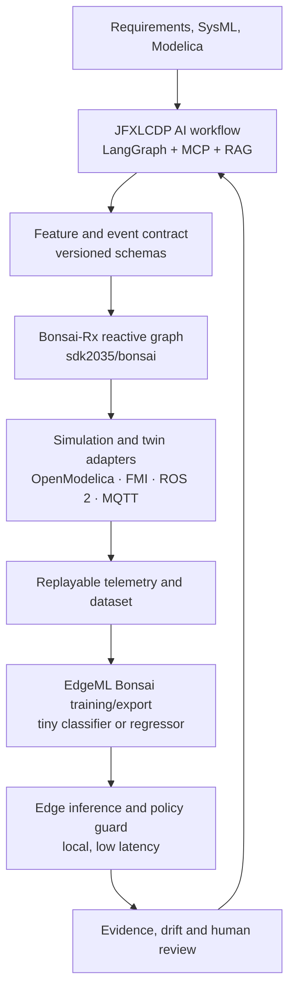

# JFXLCDP — Bonsai Integration and Edge-AI Extension

> **Consolidated English proposal for** [robotics-intelligent-systems/jfxlcdp](https://github.com/robotics-intelligent-systems/jfxlcdp).  This document is ready to be inserted after the repository's **Open-Source AI Integration Proposal** section.

## Scope and status

This addendum expands JFXLCDP's specification-driven, MBSE, Modelica, low-code and AI architecture with two independent Bonsai building blocks. It defines an open-source-oriented integration boundary for requirements, simulation, reactive streams, edge inference and evidence. It is an architecture proposal: no upstream runtime, connector, benchmark or production deployment is claimed to exist in JFXLCDP until a corresponding implementation and acceptance test is merged.

The design preserves the existing JFXLCDP chain:

```text
requirement -> specification -> model revision -> simulation/replay -> result -> review decision
```

The Bonsai extension adds a versioned feature/event contract and an edge-model lifecycle to that chain.

## Two distinct Bonsai technologies

Do not conflate the following projects. The name is shared, but the responsibilities and licensing posture are different.

| Reference | What it provides | Proposed JFXLCDP role | Classification and boundary |
|---|---|---|---|
| [Microsoft EdgeML — Bonsai wiki](https://github.com/microsoft/EdgeML/wiki/Bonsai) | A shallow, sparse tree model with powerful predictors for binary/multiclass classification, regression and ranking. The wiki describes small-memory, low-latency, offline inference for constrained devices. | Train and evaluate a compact decision model from simulator or sensor features, then export a reviewed artifact for local inference. | **Research/integration candidate.** The EdgeML repository metadata reports `Other`/`NOASSERTION` for its license; perform a file-level license and patent review before distributing code or binaries. |
| [`sdk2035/bonsai`](https://github.com/sdk2035/bonsai) | A fork of [Bonsai-Rx](https://github.com/bonsai-rx/bonsai), a C#/.NET visual reactive programming language with compiler, IDE, standard library and Rx.NET asynchronous observables. | Compose graphical dataflow, simulator adapters, feature windows, safety rules, dashboards and replayable workflows. | **Integration candidate.** The fork reports MIT, but retain upstream notices, pin the fork commit and verify all transitive packages. It is not an ML trainer. |
| Project Bonsai (managed service) | A separate, hosted machine-teaching product. | Optional future adapter only; never make it a hidden runtime dependency. | **External/optional.** It is not implied by either link above and must be isolated behind a provider-neutral contract if adopted. |

## Expanded integration architecture



### Plane responsibilities

| Plane | Responsibilities | Required controls |
|---|---|---|
| **Specification and AI plane** | Parse requirements, retrieve approved engineering knowledge, generate feature definitions and reviewable workflow changes. | Versioned specifications, citations, typed MCP tools, human approval. |
| **Reactive stream plane** | Execute Bonsai-Rx graphs for acquisition, windowing, filtering, feature calculation, visualization and simulator coupling. | Schema validation, back-pressure, bounded queues, deterministic replay and graph revision IDs. |
| **Simulation/twin plane** | Run OpenModelica/FMI/ROS 2/MQTT adapters, generate labelled scenarios and compare model predictions with physical or synthetic signals. | Sandboxed workers, unit checks, scenario manifests and independent assertions. |
| **Edge inference plane** | Run the exported EdgeML Bonsai model and a safety fallback close to the sensor or actuator. | Resource budgets, signed artifacts, watchdogs, confidence/OOD checks and fail-safe behavior. |
| **Evidence and governance plane** | Connect requirements to features, data, model commits, evaluations, deployed artifacts and decisions. | Immutable audit events, SBOM, SPDX/CycloneDX records, retention policy and rollback. |

## Categorized alternative open-source compendium

The inventory below supplements the existing JFXLCDP dependency compendium. “Candidate” means that the project is proposed, not installed or validated by the repository.

| Category | Primary candidate | Open alternative or fallback | JFXLCDP classification | Adoption rule |
|---|---|---|---|---|
| Specification/MBSE | Existing SDD + SysML/Modelica + EMF | Capella/OpenMBEE | Core candidate | Requirements and units remain the source of intent. |
| AI workflow | LangGraph + MCP + local model adapter | A typed state machine with no LLM dependency | Core candidate | Keep graph state, tool calls and review checkpoints persistent. |
| Visual reactive programming | [`sdk2035/bonsai`](https://github.com/sdk2035/bonsai) | [Bonsai-Rx upstream](https://github.com/bonsai-rx/bonsai), Node-RED or plain Rx.NET | Integration candidate | Use for stream composition and visualization; do not treat it as the edge learner. |
| Tiny edge learning | [EdgeML Bonsai](https://github.com/microsoft/EdgeML/wiki/Bonsai) | Compact CART/Random-Forest baseline, [ONNX Runtime](https://github.com/microsoft/onnxruntime) or [TensorFlow Lite Micro](https://github.com/tensorflow/tflite-micro) | Research/integration candidate | Select only after accuracy, memory, latency, energy and license gates pass. |
| Feature engineering | Rx.NET operators plus a versioned Python reference implementation | River or NumPy/SciPy reference pipeline | Integration candidate | The reference and edge implementations must agree on units, ordering and missing-value behavior. |
| Physics and digital twin | OpenModelica + OMPython + FMI/FMPy | Gazebo, Webots or a domain-specific simulator | Runtime candidate | Every generated dataset carries solver, model, parameter and scenario revisions. |
| Device/robot transport | ROS 2, MQTT and typed REST/gRPC adapters | Kafka/NATS for higher-throughput backbones | Integration candidate | Normalize transports into one JFXLCDP event envelope. |
| Storage and registry | PostgreSQL + object storage + Qdrant | SQLite/Parquet for an offline profile | Core candidate | Store specifications, features, datasets, model cards and evidence with checksums. |
| Observability | OpenTelemetry + Prometheus/Grafana | Structured logs and local metrics for disconnected nodes | Optional/runtime | Monitor latency, dropped events, drift, confidence and resource use. |
| Verification | Deterministic replay, property tests and independent numerical assertions | Formal methods or statistical model checking where justified | Test/integration | No deployment without a reproducible evidence bundle. |
| Artifact governance | SPDX/CycloneDX SBOM, signed model manifest and Git provenance | Manually reviewed notices for prototypes | Governance/build | Treat missing or ambiguous license data as a release blocker. |

## Algorithms and decision patterns

The first row is the referenced EdgeML algorithm; the remaining rows are proposed JFXLCDP patterns that make the algorithm useful in a safety-aware workflow.

| Algorithm/pattern | Input | Output | Where it runs | Acceptance checks |
|---|---|---|---|---|
| **EdgeML Bonsai** | Fixed-length, normalized feature vector | Class, score, regression value or ranking score | Workstation/cloud for training; device for inference | Task metric, memory/flash, p95 latency, energy and offline operation. |
| Compact tree baseline | Same feature contract | Interpretable baseline prediction | Python reference and optional edge build | Compare against Bonsai and a domain baseline; retain confusion/error analysis. |
| Reactive windowing | Timestamped sensor/simulation events | Ordered windows and derived features | Bonsai-Rx graph | No leakage, bounded latency, explicit clock and missing-data policy. |
| Calibration and thresholding | Model scores plus validation set | Confidence, action threshold and abstention | Edge guard or gateway | Calibrate on a held-out revision; measure false-positive/false-negative costs. |
| OOD/anomaly guard | Features, confidence and sensor quality | `accept`, `abstain`, `fallback` or alert | Edge/gateway | Inject noise, missing sensors and unseen scenarios; verify safe fallback. |
| Scenario/curriculum scheduling | Requirement limits and simulation scenarios | Ordered training/evaluation suites | JFXLCDP workflow | Every scenario is reproducible and linked to a requirement or hazard. |
| Active-learning queue | Low-confidence or novel observations | Human-labelled sample candidates | Gateway/engineering review | Never auto-promote labels; preserve reviewer identity and source evidence. |
| Safety policy/shield | Proposed decision plus invariants | Allowed decision or safe fallback | Edge and simulator | Assert hard limits independently of the learned model. |

EdgeML Bonsai should be treated as a compact supervised model, not as a generative model, planner or replacement for a safety controller. Learned outputs remain advisory until the independent policy layer and engineering review approve them.

## Versioned data and model contracts

### Event envelope

All Bonsai-Rx, simulator and device adapters should normalize to one envelope. The exact transport may be MQTT, ROS 2, REST/gRPC or a local in-process observable.

```json
{
  "event_type": "telemetry.feature_vector",
  "schema_version": "1.0.0",
  "event_id": "uuid",
  "asset_id": "asset-001",
  "timestamp": "2026-01-01T00:00:00Z",
  "source": {"kind": "simulator", "revision": "git-sha"},
  "features": {"temperature_c": 42.1, "vibration_rms": 0.18},
  "quality": {"missing": false, "confidence": 0.99},
  "trace": {"requirement_ids": ["REQ-THERM-001"], "scenario_id": "SCN-07"}
}
```

### Edge-model manifest

The manifest is a JFXLCDP contract, not an upstream EdgeML API. Replace placeholders with measured values and pin the source commits before release.

```yaml
model_id: jfxlcdp.edge.bonsai.v0
algorithm: edgeml-bonsai
task: multiclass_classification
feature_schema: telemetry.feature_vector/1.0.0
input:
  dtype: float32
  shape: [64]
  normalization: feature-contract-v1
output:
  labels: [normal, warning, emergency]
  abstention: enabled
budgets:
  max_flash_bytes: requirement-defined
  max_ram_bytes: requirement-defined
  max_p95_latency_ms: requirement-defined
provenance:
  training_dataset: dataset-revision
  source_commit: pinned-edgeml-commit
  toolchain: pinned-toolchain
  license_review: required
validation:
  replay_suite: suite-revision
  baseline: compact-tree-v0
  approval: human-review-id
```

## Proposed connector and MCP boundary

These names are JFXLCDP proposals and must not be presented as APIs supplied by either Bonsai repository.

| Operation | Input | Output | Safety boundary |
|---|---|---|---|
| `bonsai_compile_reactive_graph` | Graph revision and package lock | Compile diagnostics and graph manifest | Run in an isolated worker; reject undeclared I/O. |
| `bonsai_replay_stream` | Event dataset and graph revision | Deterministic feature stream and timing report | Enforce schema, ordering and resource limits. |
| `bonsai_train_edge_model` | Feature dataset, labels and manifest | Candidate model, metrics and model card | No promotion; attach dataset and code provenance. |
| `bonsai_export_edge_artifact` | Approved model and target profile | C/C++ or runtime artifact plus SBOM | Sign artifact; record compiler and quantization settings. |
| `bonsai_evaluate_artifact` | Artifact, replay suite and resource probe | Accuracy, robustness, latency, memory and energy evidence | Fail closed when a required metric is absent. |
| `bonsai_publish_decision` | Evidence bundle and reviewer decision | Traceability event and deployment/rollback instruction | Require an authorized human for safety-critical profiles. |

## End-to-end operating workflow

1. Capture a requirement, units, limits, hazard assumptions and acceptance criteria in the existing JFXLCDP specification model.
2. Derive a feature schema and event envelope; obtain engineering review before collecting or generating data.
3. Build a Bonsai-Rx graph for acquisition, filtering, windowing, feature computation and visualization. Keep a Python/reference path for cross-checks.
4. Run simulator-in-the-loop and replayable tests through OpenModelica/FMI/ROS 2/MQTT adapters. Version every scenario and label.
5. Train EdgeML Bonsai and a compact baseline; compare predictive quality and resource budgets on a held-out revision.
6. Export a signed edge artifact only after policy, robustness, license and reproducibility gates pass.
7. Deploy with a watchdog and safe fallback, collect drift/resource evidence, and route uncertain samples to human review before retraining.

## Verification and acceptance gates

| Gate | Evidence required | Release decision |
|---|---|---|
| Functional | Reactive graph compiles; event schema and units validate; deterministic replay matches the reference implementation. | Block on schema, unit or ordering errors. |
| Predictive | Requirement-linked metrics, calibration, confusion/error analysis and comparison with the compact baseline. | Block if the requirement-defined threshold is not met. |
| Resource | Measured p95 latency, peak RAM/flash and energy on the target profile. | Block when any budget is exceeded. |
| Robustness | Missing/noisy sensors, OOD scenarios, timing jitter, boundary conditions and adversarial input checks. | Require abstention or safe fallback where appropriate. |
| Safety | Independent invariants, action limits, watchdog and rollback exercise. | Human approval required for safety-critical use. |
| Reproducibility | Pinned data, source commits, toolchain, seed, manifest, SBOM and evidence hash. | Block if the artifact cannot be rebuilt or audited. |
| Legal/provenance | File-level notices, SPDX mapping, dependency review and patent/FTO assessment. | Do not distribute an artifact with unresolved obligations. |

## Security, licensing and responsible AI

- Treat visual graphs, model files and prompts as untrusted input; sandbox compilation and cap CPU, memory, file and network access.
- Sign graph packages, datasets, model manifests and edge binaries; verify signatures at deployment and support rollback to the last approved artifact.
- Keep secrets and private telemetry outside prompts and public vector indexes. Apply project-level access filters to RAG and event replay.
- Keep a human in the loop for requirement changes, safety policies, labels, model promotion and deployment.
- `sdk2035/bonsai` reports MIT, but a fork can contain changed files and inherited dependencies; preserve notices and pin the exact commit.
- The EdgeML GitHub metadata reports `Other`/`NOASSERTION`, so the implementation must not be labelled “software libre compatible” without a legal review of each file and dependency. A clean-room or permissively licensed reimplementation is a separate work item, not an assumption.
- No architecture statement grants patent freedom. Run a jurisdiction-specific FTO/patent review before commercial or safety-critical release.

## Delivery roadmap

| Stage | Deliverables | Exit criterion |
|---|---|---|
| 0 — Inventory and governance | ADR distinguishing EdgeML Bonsai from Bonsai-Rx; license/provenance register; target hardware profile. | Owners, source commits and legal status are recorded. |
| 1 — Contracts and smoke test | Event envelope, feature schema, Bonsai-Rx graph fixture and adapter interface. | A deterministic stream passes through the graph and reference implementation. |
| 2 — Edge baseline | EdgeML Bonsai candidate, compact baseline, model manifest and resource probe. | Metrics and budgets are measured on a held-out replay suite. |
| 3 — Simulation/twin loop | OpenModelica/FMI/ROS 2/MQTT fixtures, scenario catalogue and traceability links. | Requirement-to-scenario-to-evidence chain is reviewable. |
| 4 — Safety and operations | OOD guard, policy shield, signing/SBOM, monitoring and rollback. | All release gates pass with human approval. |
| 5 — Portability | ONNX/TFLM or another permissive fallback, disconnected profile and migration tests. | The project can replace either Bonsai component without changing specifications. |

## Maintenance note for the JFXLCDP README

Add a Table-of-Contents entry for **Bonsai Integration and Edge AI Extension** and place this section after **Open-Source AI Integration Proposal**. Keep the status statement and source links current, update pinned commit IDs, and move rows from *candidate* to *runtime* only after the acceptance gates above are implemented in CI.

### Primary references

- [JFXLCDP repository and current project description](https://github.com/robotics-intelligent-systems/jfxlcdp)
- [Microsoft EdgeML Bonsai algorithm wiki](https://github.com/microsoft/EdgeML/wiki/Bonsai)
- [Microsoft EdgeML source repository](https://github.com/microsoft/EdgeML)
- [SDK2035 Bonsai fork](https://github.com/sdk2035/bonsai)
- [Bonsai-Rx upstream documentation](https://bonsai-rx.org/docs/)

